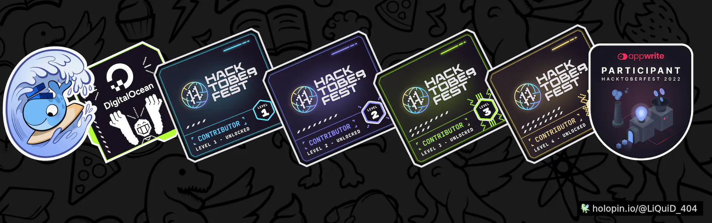

  
  <h1 align="left">Hi 👋, I'm Rishika Vishnoi</h1>
<h3 align="left">Mentor at @SWOC || Web Developer || B.tech (CSE) || @hackclub RAIT Summer of code|| SSOC'2022 || Open Source Contributor passionate frontend developer from India</h3>

- 🔭 I’m currently working on **major projects**

- 🌱 I’m currently learning **Blockchain , Typescript**

- 📝 I regularly write articles on [Hashnode](Hashnode)

- 💬 Ask me about **React , JavaScript**

- 📫 How to reach me **Rishikavishnoi56@gmail.com**

<h3 align="left">Connect with me:</h3>

<h3 align="left">Languages and Tools:</h3>

                 

&nbsp;

   

 
 
---

 
 ### 🏆GitHub Trophies

 
 
Name |Description | Source Code   | Deployed at   | 
---  | ---        |:------------: |:-------------:|
Musicnoi | Musicnoi is a music player webapp  that is build using  Reactjs that contains following features such as song download , skip , forward ,play , pause , speed control etc  | [Repo](https://github.com/Rishikavishnoi/Music-player-ReactJs) | [Netlify](https://musicnoi.netlify.app/)
Solar System | Build a solar system using pure CSS animations in which all planet revolve around the sun in their orbit  | [Repo](https://github.com/Rishikavishnoi/solar-system) | [Demo](https://rishikavishnoi.github.io/solar-system/)

<!-- # 💻 Tech Stack:
            
-->

## Connect with me  

<!--   -->
  

  

  

<!--  <!-- #### ✍️ Random Dev Quote

-->
<!--    
  

<!--  --> 

